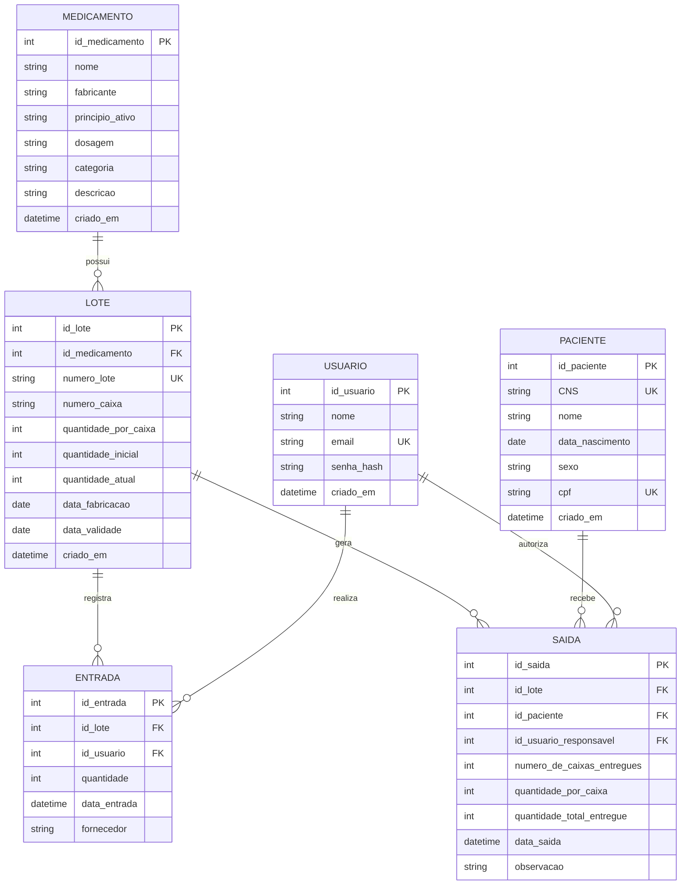

### Demo
[sihealth.netlify.app](https://sihealth.netlify.app/)

## Prototipação

[Protótipo do Figma](https://www.figma.com/design/pKAobTKfXAHKnxdDITKhxo/Telas-Primciapis?node-id=0-1&t=KNkqDQB5BuBcFDio-1)

## 📌 Roadmap do Projeto

```mermaid
flowchart TD
    A[Projeto Social - UBS Educacional] --> B[Sprint 1: Infraestrutura + CRUD Inicial]
    A --> C[Sprint 2: CRUD Completo + Dashboard]
    A --> D[Sprint 3: Gestão de Estoque + Relatórios]

    %% Sprint 1
    B --> B1[Backend Sprint 1]
    B --> B2[Frontend Sprint 1]

    B1 --> B1a[Criar projeto FastAPI - estrutura base]
    B1 --> B1b[Configurar conexão MongoDB Atlas]
    B1 --> B1c[Implementar ODMantic ou Motor]
    B1 --> B1d[Modelo e schema Medicamento]
    B1 --> B1e[Endpoints iniciais: POST e GET medicamentos]
    B1 --> B1f[Testar na documentação FastAPI]
    B1 --> B1g[Critérios: API sem erros, conexão estável, cadastro e listagem ok]

    B2 --> B2a[Setup inicial com HTML, CSS e JS]
    B2 --> B2b[Layout base: Navbar e Sidebar]
    B2 --> B2c[Tela Listagem Medicamentos - mock]
    B2 --> B2d[Componente de Tabela Reutilizável em JS]
    B2 --> B2e[Critérios: tela aparece, navegação funciona, layout pronto]

    %% Sprint 2
    C --> C1[Backend Sprint 2]
    C --> C2[Frontend Sprint 2]

    C1 --> C1a[Modelo e schema Usuário - nome, cargo, cpf]
    C1 --> C1b[Finalizar CRUD Medicamento: GET, PUT, DELETE]
    C1 --> C1c[Testes no Insomnia ou Postman]
    C1 --> C1d[Critérios: CRUD completo, banco salva, atualizar e remover ok]

    C2 --> C2a[Integração listagem com API - GET real]
    C2 --> C2b[Tela Cadastro e Editar Medicamento]
    C2 --> C2c[Ações: Criar, Editar, Deletar + feedback visual]
    C2 --> C2d[Dashboard Home - dados mock: total, estoque baixo, últimos cadastros]
    C2 --> C2e[Critérios: UI CRUD completo, tabela atualiza, dashboard aparece]

    %% Sprint 3
    D --> D1[Backend Sprint 3]
    D --> D2[Frontend Sprint 3]

    D1 --> D1a[Modelo Movimentação - entrada, saída, quantidade, medicamento, usuário, data]
    D1 --> D1b[Endpoints: POST entrada, POST saída, GET histórico]
    D1 --> D1c[Regras: não permitir saída maior que estoque, atualizar estoque automático]
    D1 --> D1d[Relatórios: estoque baixo, movimentações]
    D1 --> D1e[Critérios: estoque correto, bloqueio saída insuficiente, histórico ok]

    D2 --> D2a[Telas: Entrada Estoque, Saída Medicamento, Histórico Movimentações]
    D2 --> D2b[Relatórios simples: estoque baixo]
    D2 --> D2c[Feedback: entrada registrada, saída registrada, estoque insuficiente]
    D2 --> D2d[Critérios: fluxo completo UI, estoque e histórico atualizados, validações ok]
```

